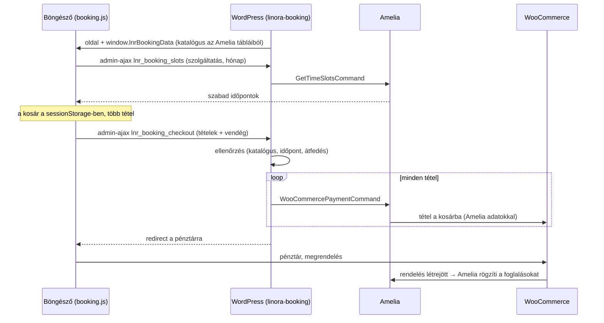

# Linora időpontfoglaló – fejlesztői dokumentáció

Ez a leírás annak szól, aki a `linora-booking` bővítményt karbantartja vagy bővíti. A telepítés és az üzemeltetés a [README.md](README.md)-ben van.

## Tartalom

1. [Áttekintés](#1-áttekintés)
2. [Függőségek](#2-függőségek)
3. [Fájlok és osztályok](#3-fájlok-és-osztályok)
4. [Adatmodell az Ameliában](#4-adatmodell-az-ameliában)
5. [A katalógus](#5-a-katalógus)
6. [AJAX végpontok](#6-ajax-végpontok)
7. [Amelia-integráció](#7-amelia-integráció)
8. [WooCommerce-integráció](#8-woocommerce-integráció)
9. [Frontend](#9-frontend)
10. [Importáló](#10-importáló)
11. [Biztonság](#11-biztonság)
12. [Tesztelés](#12-tesztelés)
13. [Gyakori módosítások](#13-gyakori-módosítások)
14. [Amelia- és WooCommerce-frissítés után](#14-amelia--és-woocommerce-frissítés-után)
15. [Ismert korlátok](#15-ismert-korlátok)

## 1. Áttekintés

A bővítmény három rendszert köt össze:

- **Konfigurátor (saját kód):** a vendég felülete a blokkban. Itt választja ki a nemet, a testtájat, a területet, az alkalmak számát és az időpontot. A kosarat a böngésző `sessionStorage`-e tárolja a pénztárig.
- **Amelia:** a kínálat (szolgáltatások, bérletek, árak, kezelési idők), a szabad időpontok és maguk a foglalások.
- **WooCommerce:** számlázás, fizetés, rendelés. Az Amelia WooCommerce-integrációja a rendeléskor rögzíti a foglalásokat.

Saját adatbázis-tábla, saját beállítás és saját post type nincs. Minden adat az Ameliában vagy a WooCommerce-ben él, a bővítmény csak összeköti őket.



## 2. Függőségek

| Függőség | Tesztelt verzió | Mire kell |
|---|---|---|
| WordPress | 7.2 (az éles oldallal azonos adatbázis-verzió) | legalább 6.5 (`wp_is_serving_rest_request`) |
| PHP | 8.4 | legalább 7.4 |
| Amelia **Pro** (vagy magasabb) | 9.8.2 | csomagok (bérletek) és WooCommerce-fizetés; a Lite és a Starter nem elég |
| WooCommerce | 11.1.2 | klasszikus `[woocommerce_checkout]` pénztár (a blokkos pénztárral nincs kipróbálva) |
| `iu_custom_blocks` mu-plugin | 0.1.0 | `iucb_add_block()`, a téma része |
| `iu_theme` / `child` téma | – | színek (`theme.json` paletta), betűk (`vars.css`), `.iu-button`, `.iu-modal` |

Ha az Amelia nincs bekapcsolva, a katalógus üres. Ha a WooCommerce nincs bekapcsolva, a pénztár végpont 503-at ad. A blokk ilyenkor sem okoz hibát.

## 3. Fájlok és osztályok

```
linora-booking/
├── linora-booking.php      belépési pont: konstansok, require, hookok
├── includes/
│   ├── catalog.php         LNR_Booking_Catalog     Amelia sorok → konfigurátor-kínálat
│   ├── amelia.php          LNR_Amelia              Amelia táblák olvasása, parancsok futtatása
│   ├── checkout.php        LNR_Booking_Checkout    AJAX végpontok, ellenőrzés, kosár/rendelés nevek
│   ├── block.php           LNR_Booking_Block       iucb blokk, assetek, inline adat
│   └── importer.php        LNR_Booking_Importer    árlista → Amelia (Eszközök menü)
├── data/pricelist.php      a megegyezett árlista PHP tömbként
└── assets/
    ├── booking.js          konfigurátor (vanilla JS, függőség nélkül)
    └── booking.css         stílus
```

Konstansok: `LNR_BOOKING_VERSION`, `LNR_BOOKING_FILE`, `LNR_BOOKING_DIR`.

A hookok mind a `linora-booking.php`-ban vannak:

| Hook | Kezelő | Miért |
|---|---|---|
| `register_activation_hook` | `LNR_Amelia::ensure_settings` | Amelia `bookMultiple` be (lásd 7.4) |
| `plugins_loaded` (1) | `LNR_Amelia::ensure_settings` | ugyanez, de csak a checkout AJAX kérésnél, az Amelia init (10) előtt |
| `init` (20) | `LNR_Booking_Block::register` | blokk regisztrálása az iucb-ben (az iucb a 999-es prioritáson regisztrál) |
| `wp_enqueue_scripts` | `LNR_Booking_Block::register_assets` | JS/CSS regisztrálása; betölteni csak a blokk rendereléskor tölti be |
| `wp_ajax(_nopriv)_lnr_booking_slots` | `LNR_Booking_Checkout::ajax_slots` | szabad időpontok |
| `wp_ajax(_nopriv)_lnr_booking_checkout` | `LNR_Booking_Checkout::ajax_checkout` | tételek a WooCommerce kosárba |
| `amelia_before_wc_cart_filter` | `LNR_Booking_Checkout::tag_cart_item` | saját tételnév (`lnrLabel`) a kosártételbe |
| `woocommerce_cart_item_name` | `LNR_Booking_Checkout::cart_item_name` | tételnév a kosárban és a pénztárban |
| `woocommerce_checkout_create_order_line_item` (20) | `LNR_Booking_Checkout::order_item_name` | tételnév a rendelésben (és így a számlán) |
| `woocommerce_thankyou` (5) | `LNR_Booking_Checkout::clear_client_cart` | a böngészőbeli kosár ürítése |
| `admin_menu` (csak adminban) | `LNR_Booking_Importer::page` | Eszközök → Linora árlista |

## 4. Adatmodell az Ameliában

A szerkezetet a nevek adják, nincs külön konfiguráció.

| Amelia entitás | Névkonvenció | Jelentés a konfigurátorban |
|---|---|---|
| Kategória | `<Nem> – <Testtáj>`, pl. `Női – Arc` | 1. lépés (nem) és 2. lépés (testtáj) |
| Szolgáltatás | `<Terület> (<nem kisbetűvel>)`, pl. `Bajusz (női)` | 3. lépés (terület), az ára az 1 alkalom ára |
| Csomag | `<szolgáltatás neve> – <N> alkalmas bérlet` | N alkalmas bérlet; **csak az számít, hogy egyetlen szolgáltatást tartalmaz N ≥ 2 darabszámmal**, a név mindegy |

Szabályok (`LNR_Booking_Catalog::build`):

- **Kategória:** csak `visible` státuszú, és a nevében legyen elválasztó (` – `, ` - ` vagy ` — `). A nem a nevének első fele, a testtáj a második. A sorrend a `position`, azonos pozíciónál az `id` szerint.
- **Szolgáltatás:** csak `visible` és `show = 1`. Sorrend: `position`, azonos pozíciónál `id`. A kijelzett névből lemarad a `(női)` / `(férfi)` utótag.
- **Ár:** ha a szolgáltatás munkatárshoz van rendelve, a látható munkatársak `providers_to_services.price` értékeinek minimuma. Ha nincs hozzárendelve, a `services.price`. Az Amelia a munkatárs árával számol, ezért ez a pontosabb.
- **Bérlet:** `visible` csomag, pontosan egy `packages_to_services` sorral, `quantity ≥ 2`. Ha egy szolgáltatásnak két azonos darabszámú bérlete is van, az első (kisebb `id`) számít.
- **Üres elemek:** a szolgáltatás nélküli kategória és a kategória nélküli nem kimarad.

Az Amelia az időpontokat **UTC-ben** tárolja (`appointments.bookingStart`). A bővítmény mindenhol a WordPress időzónájában (`Europe/Budapest`) dolgozik, az átváltást az Amelia végzi.

## 5. A katalógus

A `LNR_Booking_Catalog::get()` kérésenként egyszer épít (statikus cache). Az importáló a `reset()` hívással üríti. A frontend ugyanezt a szerkezetet kapja:

```json
{
  "genders": [
    {
      "key": "noi",
      "label": "Női",
      "groups": [
        {
          "key": "arc",
          "label": "Arc",
          "items": [
            {
              "id": 3,
              "name": "Bajusz",
              "duration": 1800,
              "options": [
                { "n": 1, "price": 8000, "packageId": null },
                { "n": 4, "price": 28800, "packageId": 4 },
                { "n": 8, "price": 51200, "packageId": 5 }
              ]
            }
          ]
        }
      ]
    }
  ]
}
```

- **`duration`:** a **foglalt** idő másodpercben, nem a szolgáltatásé. A szolgáltatás idejét a bővítmény az Amelia idősáv-hosszára kerekíti fel (`booked_duration()`, lásd 7.5). Ezt használja az átfedés-ellenőrzés (JS és PHP), a szabad időpontok lekérése és a foglalás.
- **`key`:** a címke ékezet nélkül. A blokk „Kezdő lépés” beállítása ezt használja (`noi`, `ferfi`).
- **`find($catalog, $serviceId, $packageId)`:** szerveroldalon ezzel keresünk. Csak olyan (szolgáltatás, bérlet) párt ad vissza, ami a katalógusban tényleg összetartozik.

## 6. AJAX végpontok

Mindkettő `admin-ajax.php`. Nem REST: a WooCommerce ugyanúgy betölti a kosarat és a sessiont admin-ajaxban, mint a frontend kéréseknél, és az Amelia saját foglalóűrlapja is ezt használja.

### `GET ?action=lnr_booking_slots&service=<id>&month=<YYYY-MM>`

Egy szolgáltatás szabad kezdési időpontjai egy hónapra.

- A `service` csak katalógusban szereplő szolgáltatás lehet.
- Az aktuális hónapnál korábbi vagy 13 hónapnál későbbi hónapra üres választ ad (nem hiba).
- Az időpontok a WordPress időzónájában jönnek. Az érték annak a munkatársnak az Amelia-azonosítója, akit az Amelia elsőként ajánl.

```json
{ "success": true, "data": { "slots": { "2026-09-28": { "09:00": 1, "09:30": 1 } } } }
```

| Kód | Mikor |
|---|---|
| 400 | ismeretlen szolgáltatás vagy hibás hónap |
| 500 | az Amelia parancs hibát adott |

### `POST action=lnr_booking_checkout, payload=<JSON>`

A kosár tételei a WooCommerce kosárba. Siker esetén a pénztár URL-jét adja vissza.

```json
{
  "customer": { "lastName": "Teszt", "firstName": "Elek", "email": "teszt@example.com", "phone": "+36 30 123 4567" },
  "items": [
    { "uid": "muhdx6s9cxu5ia", "serviceId": 3, "packageId": 4, "start": "2026-09-28 10:00", "providerId": 1 },
    { "uid": "muhdx78ymo3cv9", "serviceId": 13, "packageId": null, "start": "2026-09-28 10:30", "providerId": 1 }
  ]
}
```

Ellenőrzés sorrendben (`validate_customer`, majd `validate_items`):

1. **Vendég:** a vezeték- és keresztnév nem üres, az e-mail érvényes (`is_email`), a telefon `^\+?[0-9 ()/-]{7,20}$`.
2. **Tételek száma:** 1–10 (`MAX_ITEMS`).
3. **Tétel a katalógusban:** a (szolgáltatás, bérlet) pár létezik a katalógusban.
4. **Időpont:** `start` pontosan `Y-m-d H:i` formátumú, létező dátum, a jövőben van, és van `providerId`.
5. **Átfedés:** a tételek (`start` + foglalt idő) nem fedhetik egymást. A hiba a később kezdődő tételhez kerül.

**Az árat a kliens nem küldi, és a szerver nem is fogadná el:** minden tételt az Amelia áraz.

```json
{ "success": false, "data": { "uid": "muhdx78ymo3cv9", "message": "Hónalj (női) – 1 alkalom: ez az időpont közben foglalt lett. Kérjük, válasszon másikat." } }
```

| Kód | Mikor |
|---|---|
| 200 | `{ "redirect": "<pénztár URL>" }` |
| 400 | hibás vendégadat vagy tétel (a `uid` jelzi, melyik tétel) |
| 409 | az Amelia elutasított egy tételt (pl. időközben foglalt lett). Ilyenkor az összes Amelia-tétel kikerül a kosárból, félkész kosár nem marad. |
| 503 | nincs WooCommerce kosár vagy nincs Amelia |

A kosár a konfigurátort tükrözi. Beküldés előtt minden korábbi Amelia-tétel kikerül a WooCommerce kosárból (a nem Amelia-termékek, pl. ajándékutalvány, maradnak), így a konfigurátorba visszatérve és újra beküldve nem duplázódik semmi.

## 7. Amelia-integráció

### 7.1 Parancsok közvetlenül a command buson

A `LNR_Amelia::run()` az Amelia saját konténeréből veszi a command bust, és ugyanazokat a parancsokat futtatja, amelyeket az Amelia foglalóűrlapja az `admin-ajax.php?action=wpamelia_api` hívásokkal:

| Parancs | Mire |
|---|---|
| `Booking\Appointment\GetTimeSlotsCommand` | szabad időpontok (`page = booking`, azaz frontendes szabályokkal: minimum előre foglalási idő, maximum napok) |
| `PaymentGateway\WooCommercePaymentCommand` | tétel ellenőrzése, árazása és a WooCommerce kosárba tétele |

Az Amelia HTTP-rétegét (Slim route, nonce-ellenőrzés) megkerüljük, a parancskezelők és a foglalási logika viszont ugyanaz. A jogosultság- és felhasználószolgáltatás a konténerből kerül a parancsba, ahogy az Amelia `Controller::__invoke()`-ja is teszi.

### 7.2 A kosárba tett adat

A `LNR_Amelia::add_to_wc_cart()` ugyanazt a szerkezetet állítja össze, amit az Amelia v3-as űrlapja küld (a fejlesztői oldal egy valódi rendeléséből visszafejtve). A két típus eltérése:

| Mező | 1 alkalom (`appointment`) | Bérlet (`package`) |
|---|---|---|
| `type` | `appointment` | `package` |
| `serviceId`, `providerId`, `bookingStart` | a foglalás adatai | ugyanaz (a kosártétel címkéjéhez kell) |
| `packageId` | – | a csomag |
| `package` | `[]` | `[{serviceId, providerId, locationId: null, bookingStart, notifyParticipants: 1, utcOffset: null}]` – az első alkalom |
| `packageRules` | – | `[{serviceId, providerId, locationId: null}]` |

Közös mezők:
- `bookings[0].customer`: név, e-mail, telefon, `id: null`. Az Amelia e-mail alapján megtalálja vagy létrehozza az ügyfelet.
- `bookings[0].duration`: a foglalt idő.
- `payment.gateway = wc`.
- `timeZone`: a WordPress időzónája.
- `utcOffset: null`: a csomag-kosáradatnál az Amelia olvassa, a hiánya PHP-figyelmeztetést ad.
- `componentProps`: az Amelia ebből menti a kosártétel `cacheData`-ját. Nálunk csak a minimálisan szükséges váz.

### 7.3 Hibák

A sikertelen parancs `data` tömbjében az Amelia egy kulcsot állít be. Ezeket a `LNR_Amelia::ERRORS` magyar szövegre fordítja: `timeSlotUnavailable`, `customerAlreadyBooked`, `customerBlocked`, `emailError`, `phoneError`. Minden másnál az Amelia saját üzenete megy tovább.

### 7.4 `bookMultiple`

Az Amelia alapból minden `addToCart`-nál kiveszi a kosárból a korábbi Amelia-tételeket. Az `amelia_settings` opcióban (JSON string) a `payments.wc.bookMultiple = true` ezt kikapcsolja. Ezt állítja be az `ensure_settings()`.

**Miért `plugins_loaded` 1-es prioritással:** az Amelia `SettingsStorage` kérésenként egyszer olvassa be a beállításokat. Ha a kérés közben írnánk át, ugyanebben a kérésben még a régi érték élne.

### 7.5 Idősáv-rács

Az Amelia a szabad kezdési időpontokat minden szabad intervallum elejétől lépteti (`general.timeSlotLength`, most 1800 mp). Egy foglalás vége új intervallum-kezdet. Példa:

- A 10:00–10:15-ös bajusz után a következő kezdési időpontok 10:15, 10:45, …
- A konfigurátor a hónalj tételnél a 10:30-at még érvényesnek látja, hiszen a bajusz ekkor még csak a kosárban van.
- A rendeléskor az Amelia előbb lefoglalja a bajuszt, utána a 10:30-as hónaljat `timeSlotUnavailable` hibával elutasítja.

**Megoldás:** a foglalt idő mindig egész idősáv (`LNR_Booking_Catalog::booked_duration()`). Így minden foglalás rácspontra esik, és a kosár tételei a rendeléskor is érvényesek maradnak. Az importált kezelési idők ezért eleve 30 perc többszörösei. A `timeBefore` / `timeAfter` buffereket a kód nem kerekíti, azokat is idősáv többszörösére kell állítani.

## 8. WooCommerce-integráció

- **A termék:** az Amelia a kosártételt a beállított WooCommerce termékkel teszi a kosárba (Amelia → Beállítások → Fizetés → WooCommerce, most „Találkozó”, ID 867). Ennek a terméknek meg kell maradnia.
- **Tételnév:** a `tag_cart_item` a kosártétel Amelia-adatába egy `lnrLabel` kulcsot tesz (pl. `Bajusz (női) – 4 alkalmas bérlet`). Ezt írja ki a `cart_item_name` a kosárban és a pénztárban, és ezt menti az `order_item_name` a rendelési tétel nevének. Az Amelia saját adatai (időpont, munkatárs) a név alatt maradnak.
- **Számlázási mezők:** a pénztárban az Amelia tölti ki előre a vendég adataiból (`checkoutGetValue`).
- **Foglalás:** a rendelés létrejöttekor és státuszváltáskor az Amelia `createBookings()` rögzíti a foglalásokat. Hogy melyik rendelési státusz milyen foglalási és fizetési státuszt ad, azt az Amelia WooCommerce-szabályai döntik el (Amelia → Beállítások → Fizetés → WooCommerce → szabályok). A bővítmény ezekhez nem nyúl.
- **Köszönőoldal:** a `clear_client_cart` a `sessionStorage` `lnrBooking` kulcsát törli.

## 9. Frontend

### 9.1 Betöltés

A blokk sablonja csak egy üres konténert ad vissza:

```html
<div class="lnr-booking" data-lnr-booking data-gender="noi">…</div>
```

A `LNR_Booking_Block::enqueue()` az első renderelésnél betölti a JS-t és a CSS-t. Oldalanként egyszer egy inline scriptet is kiír:

```js
window.lnrBookingData = { ajaxUrl, catalog, today: "Y-m-d", now: "Y-m-d H:i" };
```

A `today` és a `now` a szerver (Budapest) ideje, nem a böngészőé. A szerkesztőben az iucb `editJS` egy statikus helyőrzőt mutat, a szerveroldali renderelés ott nem fut.

### 9.2 Lépések

`booking.js`, `Configurator.state.step`:

```
gender → group → area → option → date → summary ⇄ details → (pénztár)
                   ↑                        │
                   └──── „+ Újabb terület” ─┘   (a nem megmarad, a group lépésre ugrik)
```

| Lépés | Folyamatjelző | Kilépés |
|---|---|---|
| `gender`, `group`, `area` | 1. Terület | tovább: `option` |
| `option` | 2. Alkalmak | tovább: `date` |
| `date` | 3. Időpont | tétel a kosárba (vagy szerkesztett tétel mentése) → `summary` |
| `summary` | 4. Összegzés | `details`, vagy `area`-ág újra |
| `details` | 5. Adatok | `submit()` → `lnr_booking_checkout` → átirányítás |

- **„Vissza”:** mindig az előző lépésre visz. Időpont szerkesztésekor a `date` lépésből az összegzésre.
- **Szerkesztés:** az összegzés „Időpont módosítása” gombja a `date` lépést nyitja meg `state.editing = uid` értékkel. Ilyenkor a saját tétel nem számít ütközésnek.
- **Hibás tétel:** ha a pénztár végpont egy tételt elutasít (`uid`), a nézet az összegzésre ugrik, a tétel pirosan jelölve. Az időpont-cache ürül, így új időpont választásakor friss adat jön.

### 9.3 Kosár és több példány

A `store` modulszintű objektum, minden blokkpéldány közösen használja.

```js
sessionStorage["lnrBooking"] = {
  items: [{ uid, serviceId, packageId, start: "Y-m-d H:i", providerId }],
  customer: { lastName, firstName, email, phone }
}
```

- **Betöltéskor** kimarad minden tétel, ami már nincs a katalógusban, vagy aminek az időpontja elmúlt.
- **Az ár nincs tárolva:** kirajzoláskor mindig a friss katalógusból jön.
- **Változáskor** (`store.changed(source)`) a többi példány `onStoreChange()`-et kap. Amelyik példányhoz a vendég még nem nyúlt (`touched === false`, pl. a zárt fejléc modal), az a kosár állapotára áll: összegzés, vagy ha üres a kosár, a kezdőlépés. A használt példány csak az összegzés és az időpont lépésben rajzol újra.

### 9.4 Időpontok

- **Lekérés és cache:** a `loadSlots(serviceId, month)` Promise-t ad vissza, és `szolgáltatás|hónap` kulccsal cache-el. Hiba esetén a cache-bejegyzés törlődik.
- **Első megnyitás:** a naptár a kosár utolsó tételének napjára (vagy a mai napra) áll. Ha abban a hónapban nincs szabad nap, legfeljebb 6 hónapot lép előre (`autoAdvance`).
- **Ütközés:** a `store.conflicts(date, time, duration, ignoreUid)` kiszűri a kosár többi tételével ütköző időpontokat.
- **Időkezelés:** a dátumok falióra-időként, `Date.UTC`-vel vannak összehasonlítva. Szándékosan nincs időzóna-átváltás: minden idő a szalon ideje.

### 9.5 Kirajzolás

- **Módszer:** minden lépés HTML stringként épül, `innerHTML`-lel kerül a helyére. Minden dinamikus szöveg az `esc()` függvényen megy át.
- **Események:** egy delegált `click` figyelő a `data-action` / `data-value` attribútumokra, továbbá egy `input` és egy `submit` figyelő.
- **Fókusz:** lépésváltáskor a fókusz a lépés címére kerül (`preventScroll`). Ha a komponens teteje kicsúszott a képből, az oldal visszagörget.
- **Gombok:** a téma `iu-button iu-button-default` / `iu-button-invert` osztályait használják, hogy egyezzenek a téma gombjaival.

### 9.6 CSS

- **Színek:** a téma palettájából jönnek (`--wp--preset--color--*`). A komponens ezeket saját változókra képezi le (`--lnr-bg`, `--lnr-soft`, `--lnr-accent`, `--lnr-ink` stb.), fallback értékkel.
- **A modalban** a kártyák háttere fehér, mert a modal háttere megegyezik a `--lnr-soft` színnel.

Két téma-felülírás kell `!important`-tal, mindkettő megjegyzéssel jelölve a CSS-ben:

1. A `.text-center *` szabály mindent középre igazít `!important`-tal (a főoldali oszlopon rajta van). A komponens belül balra igazít, kivéve a fejlécet, a naptárat és a gombokat.
2. A téma a főoldali foglalási oszlopon mobilon is 4,4 rem oldalsó paddinget hagy. 600 px alatt `:has([data-lnr-booking])` szelektorral 1 rem-re csökken, csak ennél az oszlopnál.

## 10. Importáló

`LNR_Booking_Importer::run($dry_run, $update_prices)`:

- **Adatforrás:** `data/pricelist.php`, szerkezete `[nem => [testtáj => [[terület, perc, [n => ár]]]]]`.
- **Egyeztetés:** minden elemet név alapján keres (a kategóriát névvel, a szolgáltatást névvel és kategóriával, a csomagot névvel). Ami nincs, azt létrehozza. Ami van, annak csak az árát frissíti (ha `$update_prices`): szolgáltatásnál a `services.price` és a `providers_to_services.price` mezőt, csomagnál a `packages.price` mezőt.
- **Nem írja felül:** a kezelési időt, a színt, a leírást és a pozíciót. Ezeket az Ameliában lehet szerkeszteni.
- **Munkatárs-hozzárendelés:** minden szolgáltatást minden látható munkatárshoz hozzárendel, a hiányzó hozzárendeléseket pótolja.
- **Új bérlet:**
  - csomag `calculatedPrice = 0` (fix ár) és `discount = 0` beállítással;
  - `packages_to_services`: `quantity = N`, `minimumScheduled = maximumScheduled = 1`, azaz vásárláskor egy alkalom foglalható;
  - `packages_services_to_providers` minden munkatárshoz.
- **Tesztadatok:** a futás végén elrejti őket (`TEST_*` konstansok), és meghívja az `ensure_settings()`-et.
- **Előnézet:** `$dry_run = true` esetén semmit nem ír, csak a jelentést adja vissza. Ezt mutatja az admin oldal táblázata.

Az írás közvetlenül `$wpdb`-vel történik, nem az Amelia repository-jain keresztül. Egyszerűbb, és az Amelia admin felülete ugyanezeket a mezőket olvassa. A mezők alapértékei a meglévő, Amelia-admin által létrehozott sorokat követik.

## 11. Biztonság

- **Nonce nincs szándékosan** a két AJAX végponton:
  - az űrlap cache-elhető nyilvános oldalakon van, és a vendégnonce lejárna;
  - a kérés csak a látogató saját kosarát tölti;
  - minden tételt az Amelia a kosárba tételkor és a rendeléskor is újraellenőriz.
- **Szerveroldali ellenőrzés:** a szerver csak katalógusban szereplő (szolgáltatás, bérlet) párt fogad el. Az árat mindig az Amelia számolja.
- **Szövegek:** a vendégadatok `sanitize_text_field` / `sanitize_email` után kerülnek az Ameliához (és az Amelia is tisztítja őket). A tételnév `esc_html`-lel kerül a kosárba.
- **Frontend:** minden szerverről vagy tárolóból jövő szöveg `esc()`-en megy át, mielőtt HTML-be kerül.
- **Importáló:** `manage_options` jogosultság és `check_admin_referer` védi.

## 12. Tesztelés

### Egységtesztek

```
php tests/linora.php
```

WordPress nélkül fut (`tests/bootstrap.php` + egy `remove_accents` csonk). Lefedi:

- a kategória- és névfeldolgozást;
- a foglalt idő kerekítését;
- a katalógus-építést (rejtett és üres elemek, sorrend, munkatárs-ár, bérlet-felismerés);
- a `find()`-ot;
- a tétel- és vendégellenőrzést (átfedés, múlt, hibás dátum, idegen bérlet, túl sok tétel);
- az árlista adatait (az árlogika 10% / 20%, a kezelési idők a 30 perces sávban).

### Helyi környezet

A fejlesztői oldal adatbázisával teljesen reprodukálható, így készült az end-to-end teszt:

1. MariaDB, a dumpból importálva (`lnrskn_` tábla-előtag).
2. WordPress, benne a `wp-content` a fejlesztői oldalról, az Amelia (Pro) és a WooCommerce a `plugins` mappában.
3. A `linora-booking` szimlinkelve a `plugins` mappába.
4. `wp-config.php` a `WP_HOME` / `WP_SITEURL` helyi címmel. Szerver: `php -S 127.0.0.1:8080` egy routerrel, ami a nem létező útvonalakat az `index.php`-ra küldi.
5. Aktiválás és import WP-CLI nélkül, egy `wp-load.php`-t betöltő szkripttel: `activate_plugin('linora-booking/linora-booking.php')`, majd `LNR_Booking_Importer::run(false)`.
6. A blokk elhelyezése: a főoldal (post 1) tartalmában az Amelia blokk cseréje `<!-- wp:linora/booking /-->`-ra, és ugyanez a Footer sablon (post 515) `booking-modal` modaljába.

Ha a wordpress.org nem érhető el, a WooCommerce a `woocommerce/woocommerce` monorepóból is felépíthető a PHP-részhez elég mértékben:
- sparse checkout: `plugins/woocommerce` és `packages/php`;
- `COMPOSER_ALLOW_SUPERUSER=1 composer install --no-dev`;
- `php bin/generate-feature-config.php`;
- a `client/legacy/js` bemásolva `assets/js`-be (`.min.js` másolatokkal);
- a `client/legacy/css` fő fájljai `sass`-szal.

Az admin felület így nem működik (hiányoznak a React bundle-ök), a frontend, a kosár és a pénztár igen.

### End-to-end ellenőrzőlista (böngészőben, pl. Playwright)

1. Főoldal → Női → Arc → Bajusz → 4 alkalmas bérlet → egy nap 10:00 → összegzés.
2. „+ Újabb terület” → Felsőtest → Hónalj → 1 alkalom. Ugyanazon a napon a 10:00 ne legyen választható, a 10:30 igen.
3. A fejléc „Időpontfoglalás” modalja ugyanazt a két tételt mutatja.
4. Adatok → „Tovább a fizetéshez” → pénztár: két tétel saját néven, a számlázási e-mail előre kitöltve.
5. Megrendelés banki átutalással → köszönőoldal. Adatbázisban:
   - két `amelia_appointments` sor (UTC-ben 08:00 és 08:30);
   - egy `amelia_packages_to_customers` sor;
   - két `amelia_payments` sor a WooCommerce rendelés azonosítójával;
   - a `sessionStorage` üres.
6. Ütközés: egy tétel a kosárban, közben egy másik böngészőből ugyanarra az időpontra rendelés → az első böngészőben „ez az időpont közben foglalt lett”, a tétel jelölve. Időpont-módosításnál a foglalt időpont már nem választható.
7. Mobil (320 px): nincs vízszintes görgetés, a naptár és a kártyák kiférnek.
8. Szerkesztő: a blokk a Widgetek között van, helyőrzőt mutat, a „Kezdő lépés” beállítás működik.

## 13. Gyakori módosítások

| Feladat | Hol |
|---|---|
| Ár módosítása | Ameliában, vagy a `data/pricelist.php`-ban és újraimportálással |
| Új terület | Ameliában: új szolgáltatás egy `Női – …` / `Férfi – …` kategóriában, munkatárshoz rendelve. Bérlethez: csomag, amiben csak ez a szolgáltatás van N-szer. |
| Új testtáj vagy szolgáltatáscsoport (pl. RF, EMS) | Ameliában: új kategória `Női – Alakformálás` névvel. Ha tartósan az árlista része, a `pricelist.php`-ban is. |
| Új nem vagy teljesen új ág | új kategóriák `<Címke> – <Csoport>` névvel. A nem-választó kártyájának szövege: `renderGender()` („… kezelések”) |
| Kezelési idő | Ameliában a szolgáltatásnál. Maradjon az idősáv többszöröse (lásd 7.5). |
| Idősáv-hossz | Amelia → Beállítások → Általános. A kód automatikusan követi (`LNR_Amelia::slot_length()`). |
| Szövegek (lépéscímek, magyarázatok) | `assets/booking.js`, a `render*()` függvények és a `head()` hívások |
| Szerveroldali üzenetek | `includes/checkout.php`, `LNR_Amelia::ERRORS` |
| Tételnév a kosárban és a rendelésben | `validate_items()` → `label`, és `LNR_Booking_Catalog::option_label()` |
| Új mező az Adatok lépésben | `renderDetails()`, a `store.customer` alapértéke, `validate_customer()`, majd `add_to_wc_cart()` (Amelia-ügyfél vagy custom field) |
| Legfeljebb ennyi tétel | `LNR_Booking_Checkout::MAX_ITEMS` |
| Új blokkbeállítás | `LNR_Booking_Block::register()` (`attributes` + `fields`), a sablon `data-*` attribútumként adja át, a JS a `Configurator` konstruktorban olvassa |

Asset-változtatás után emeld a `LNR_BOOKING_VERSION`-t, különben a böngésző a régi fájlt használhatja.

## 14. Amelia- és WooCommerce-frissítés után

A bővítmény az Amelia belső (nem nyilvános) API-ját használja. Frissítés után ezeket kell ellenőrizni (a 12. pont end-to-end listája mindet lefedi):

- `AMELIA_PATH . '/src/Infrastructure/ContainerConfig/container.php'`, `getCommandBus()`, `getPermissionsService()`, `getUserApplicationService()`;
- a `GetTimeSlotsCommand` mezői és a válasz `slots` szerkezete (`[dátum][idő] = [[providerId, locationId], …]`);
- a `WooCommercePaymentCommand` elvárt mezői (7.2), különösen a csomagos `package` / `packageRules`;
- az `amelia_before_wc_cart_filter` filter;
- az `amelia_settings` opció formátuma (JSON string), a `payments.wc.bookMultiple` és a `general.timeSlotLength` kulcs;
- a táblanevek és oszlopok, amiket a katalógus és az importáló használ;
- a hibakulcsok (`timeSlotUnavailable` stb.);
- WooCommerce: a `woocommerce_cart_item_name` és a `woocommerce_checkout_create_order_line_item` hook, valamint a klasszikus pénztár. Blokkos pénztárra váltás esetén a tételnév és a számlázási mezők előtöltése külön ellenőrizendő.

## 15. Ismert korlátok

- **Bérlet:** vásárláskor csak az első alkalom foglalható. A többit az Amelia adminban kell foglalni a bérlet terhére.
- **Munkatárs:** a vendég nem választ munkatársat. A tétel az Amelia által elsőként ajánlottat kapja. Egy munkatársnál ez mindegy.
- **Buffer:** a `timeBefore` / `timeAfter` buffert a kód nem kerekíti (7.5).
- **Oldal-gyorsítótár:** a katalógus és a `today` / `now` a HTML-be kerül, árváltozás után a cache-t üríteni kell. A szabad időpontok mindig élőben jönnek.
- **Amelia-figyelmeztetés:** ha egy rendelésben bérlet és sima alkalom is van, az Amelia `createBookings()` egy `Undefined array key` PHP-figyelmeztetést ír a logba (Amelia 9.8.2, `WooCommerceService.php` 3338. sor). A foglalásokat nem érinti.
- **Egy nyelv:** a felület csak magyar. A szövegek a JS-ben és a PHP-ban vannak, nem fordítható stringként.
